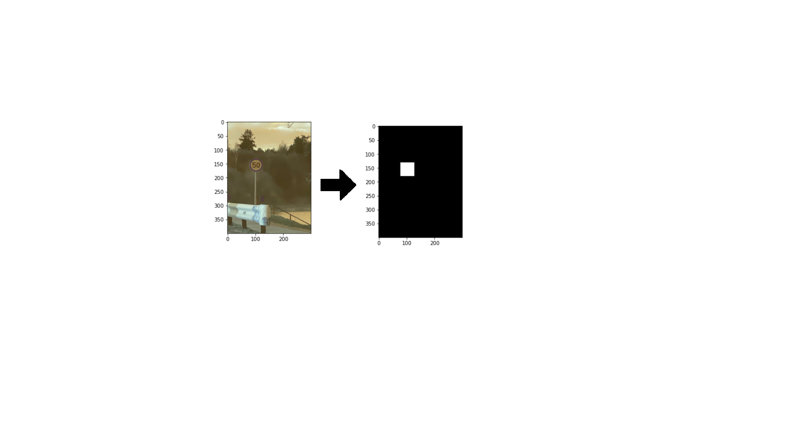
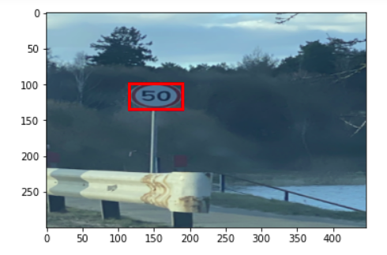
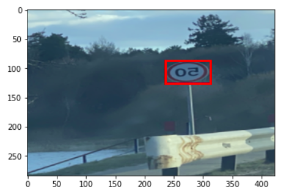
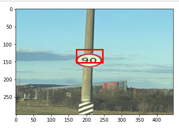

# Bounding-Box-Prediction-from-Scratch-using-PyTorch

The focus here is more on how to read an image and its bounding box,  resize  and  perform  augmentations  correctly,  rather  than  on  the  model itself.  The goal is to have a good grasp of the fundamental ideas behind objectdetection,  which  you  can  extend  to  get  a  better  understanding  of more complex techniques such as YOLO.

1.Dataset

2. Resizing Images and Bounding Boxes

* Convert the bounding box into an image (called mask) of the same size as the image it corresponds to. This mask    would just have 0 for background and 1 for the area covered by the bounding box.
* Resize the mask to the required dimensions using the information from .xml file .
* Extract bounding box coordinates from the resized mask

3.Data Augmentation
* I’ve used flip, rotation, center crop and random crop.

4.PyTorch Model
For the model, I’ve used a very simple pre-trained resNet-34 model. Since we have two tasks to accomplish here, there are two final layers — the bounding box regressor and the image classifier.

